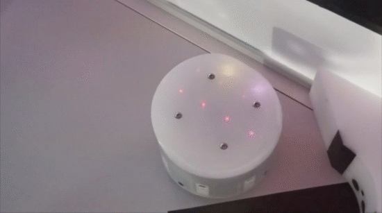

## DIFFERENTIAL WHEELED ROBOT AUTONOMOUS DOCKING 

In this project we made a differential wheeled robot named AMiRo dock to a charging point
autonomously.

#### SETTING UP THE ENVIRONMENT :

The development environment is setup in ubuntu 16.04. The following steps are tried and tested in ubuntu 16.04.

##### COMPILER SETUP for AMiRo :

0. cd ~/; sudo apt-get install cmake gcc-multilib
1. git clone <this_repo>
2. cd <this_repo>
3. cd src/amiro-blt
2. ./setup 
3. Select   [B] - enter bootloaders setup
4. Select   [S] - enter AMiRo-BLT setup
5. Select   [S] - build SerialBoot tool
6. Select y - WARNING: SerialBoot has been built before. Delete and rebuild? [y/n]
7. Select   [C] - enter compiler setup
8. Select   [G] - enter GCC setup
9. Select   [I] - install another version
10. Copy proper link from: [https://launchpad.net/gcc-arm-embedded/4.8/4.8-2014-q1-update]

        FOR UBUNTU: https://launchpad.net/gcc-arm-embedded/4.8/4.8-2014-q1-update/+download/gcc-arm-none-eabi-4_8-2014q1-20140314-linux.tar.bz2
        FOR MAC: https://launchpad.net/gcc-arm-embedded/4.8/4.8-2014-q1-update/+download/gcc-arm-none-eabi-4_8-2014q1-20140314-mac.tar.bz2
        FOR Windows: https://launchpad.net/gcc-arm-embedded/4.8/4.8-2014-q1-update/+download/gcc-arm-none-eabi-4_8-2014q1-20140314-win32.exe

11. Installation directory: ~/opt/gcc-arm-none-eabi-4_8-2014q1
12. Link directory: ~/opt
13. Select [Q] - quit this setup
14. Add gcc path to .bashrc

	echo "export PATH=$PATH:~/opt/" >> ~/.bashrc

16. Add SerialBoot path to .bashrc
   
	echo "export SERIALBOOT=\"~/AMiRo_ROBOT_Autonomous_Docking_v1/src/amiro-blt/bootloader/AMiRo-BLT/Host/Source/SerialBoot/build/SerialBoot\"" >> ~/.bashrc

17. source ~/.bashrc
18. cd ../amiro-os
19. cd devices
20. make all
21. make flash #Connect AMIRO via Serial before flashing

##### COMPILING AND FLASHING CODE TO AMiRo :

1. AMiRo needs the gcc version 4.8.3 [Make sure it is installed in your system]
2. Check gcc version by executing 

	$arm-none-eabi-gcc -v

3. Compiling code [ for more details, follow README.txt from amiro_os ]

		$cd ./amiro-os/devices
		$make all

4. Flash code to AMiRo Robot

			$make flash

##### CONNECTING TO AMiRo via SERIAL PORT :

1. Open  ~/.gtktermrc
   
      #Modify the following
	    [AMiRo]
		  port    = /dev/ttyUSB0
		  speed   = 115200
		  crlfauto    = True
		  #save and exit

2. $gtkterm -c AMiRo
	
      $[Enter F8 to enter amiro cli]
    
      #Keep amiro in deepsleep mode [it is like turning off the amiro]
	    $shutdown d

##### DOCKER CODE LOCATION :

Docker code location : <base_dir>/src/amiro-os/devices/DiWheelDrive/docker/docker_main.cpp
